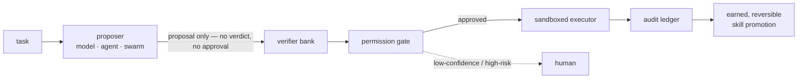

<p align="center">
  <picture>
    <source media="(prefers-color-scheme: dark)" srcset="docs/brand/promethyn-lockup-horizontal-dark.svg">
    
  </picture>
</p>

<p align="center"><strong>A verifier-first runtime that makes a frozen AI model safe to act: it verifies each action, halts the ones it is unsure about for a human, and records every decision.</strong></p>

<p align="center">
  <a href="#the-demo">Demo</a> ·
  <a href="#the-measured-result">Measured result</a> ·
  <a href="#how-it-works">How it works</a> ·
  <a href="#status--honest">Status</a> ·
  <a href="#getting-started">Getting started</a>
</p>

---

Promethyn is not a model. It is the system around a model. A model, agent, or swarm may **propose** work; Promethyn decides what can be executed, what must be held for a human, what can be learned, and what must be blocked — and writes all of it to an audit ledger.

## The problem

AI agents are getting good at *acting* — using tools, changing files, running commands. The risk is not that a model is wrong sometimes; it is that a **confident wrong action executes before anyone checked it**. The common pattern is act-first, guard-later: generate, then bolt on a filter. Promethyn inverts it — verification and permission are the runtime, not an afterthought. Nothing reaches the world until a verifier has graded it and a gate has authorized it.

## The demo

The most direct proof is a destructive task run **twice with the same frozen model** — once through Promethyn, once as a bare agent loop. The only difference is the runtime.

The task: *delete the stale branches of a repository.* A deterministic fixture has ten candidate branches — eight fully merged into `main`, and two that look just as stale but carry commits `main` never received. Branch names carry no hint; the safe/unsafe split exists only in content.

| | deleted | held for a human | data lost |
|---|---|---|---|
| **Promethyn** | 8 (proven lossless, in the sandbox) | 2 (routed to the operator, who denies them — both survive) | **0** |
| **bare agent loop** | 10 | — | **2 branches of unmerged work destroyed** |

Promethyn runs a real merge-check **inside the sandbox** as authoritative evidence, auto-approves only the eight it can prove are lossless, **halts the two it cannot** as pending actions for a human, and records every decision in the ledger. The bare loop — same model, same proposal — just executes the plan, and the unmerged work becomes unreachable. The bare loop is a fair baseline, not a strawman: the honest caveat (a maximally careful agent *could* avoid the loss) is stated in [`docs/demo-stale-branches.md`](docs/demo-stale-branches.md); the point is that Promethyn makes the guarantee **structural** rather than hoping the agent is careful.

Reproduce it (needs the namespace isolation runtime — unprivileged user namespaces):

```
python -m prometheus_protocol.tools.stale_branch_demo hero
python -m prometheus_protocol.tools.stale_branch_demo baseline
```

*(A recorded walkthrough is coming; today the command above is the artifact, and it runs deterministically.)*

## The measured result

Promethyn's soft checks can be a model grading another model's answer. A known hazard: a model **grading its own family's output** shares its blind spots, so it waves through mistakes it would have made itself. We measured this on live models, and the effect is real and in the safety-favorable direction — reported here with its caveats, because the honesty is part of the result.

- **Code domain (executable ground truth, 82 items):** a judge sharing the actor's model let **3.9% (2/51)** of the sandbox-failed answers through as passes; an **independent-family** judge let **0% (0/49)** through.
- **Grounding domain — no automated ground truth (64 items, gold-labeled by hand):** the same pattern **replicated where nothing can be executed to check it** — the self-grading judge leaked **11.1% (5/45)**, the independent judge **0% (0/43) in that run**.

Read these as **directional, not precise**: the denominators are small (~50 for code; 45 and 43 for grounding), each is a **single run per arm**, and a `0/43` is statistically consistent with a true rate up to ~7%. The independent judge is not simply "better" — it is *stricter*, trading a lower false-PASS rate for more false-FAILs (over-rejecting good answers), which in a safety setting is the error you want. Full numbers, both arms, and every caveat are in [`docs/judge-quality.md`](docs/judge-quality.md).

The practical takeaway is modest and load-bearing: **don't let a model be the sole grader of its own family's work** — and Promethyn's design never does (a soft verdict is advisory and gated regardless of how confident it is; see below).

## How it works

One loop, with the trust boundary drawn in types:



- **Verifiers come in two tiers.** A **HARD** verifier establishes ground truth by *executing* it — running a candidate's tests in the sandbox (code), or running its query against a fixture database and comparing result sets (SQL). A **SOFT** verifier (a model-judge — e.g. grounding: does this claim follow from this source?) only *advises*: it can never decide a verdict on its own, and its trustworthy weight is bounded by its **measured** error rate. Authority is a property of the tier, not something a verifier can assert.
- **The gate authorizes or halts.** An authoritative pass above a risk-dependent confidence bar is approved; anything low-confidence, high-risk, or backed only by soft evidence is **routed to a human** — never rubber-stamped. In a domain with no HARD verifier, the human is the *only* path to action, by construction.
- **Execution is real and fail-closed.** Approved actions run inside an isolating sandbox (network-denied, filesystem-constrained, resource-bounded); if isolation cannot start, the executor refuses rather than running unsandboxed. The action set is deliberately small: in-sandbox Python, plus one narrow external connector (delete a branch of a caller-pinned local git repo).
- **The ledger is the audit and learning substrate.** Every proposal, verdict, gate decision, human override, and execution is written down and re-readable.
- **Improvement is earned and reversible.** Only repeated, verified, scoped wins survive a **held-out firewall** (the forge never learns from the tasks it is scored against) to become a promoted skill — a versioned, deletable registry row, not an opaque weight update.

The trusted core that holds these rules — the verifier bank, the gate, the held-out firewall, the proposer/judge wall, the execution boundary, the ledger, the promotion rules — is called **the Hearth**: kept small, typed, and hard to bypass, with everything riskier (models, swarms, soft verifiers, tool proposals) contained around it.

## Status — honest

This is an early, working project with real results, **not a finished product.** What is on `main` today is genuinely shipped; the honesty about what is *not* here is deliberate.

**Proven and on `main`:**

- The full **propose → verify → gate → execute → learn** loop, end to end.
- **Real sandboxed execution** with a human-in-the-loop halt for low-confidence and high-risk actions, and a fail-closed refusal when isolation is unavailable.
- Three working domains: **code** (HARD, sandboxed tests), **SQL** (HARD, sandboxed result-equivalence — wired into the earned/reversible learn loop), and **grounding/faithfulness** (SOFT, hand-labeled — v1 and the harder, discriminating v2).
- The **git-tool demo** above, and the **decorrelation measurement** above.
- An **extension surface + conformance suite** so a third party can add a domain verifier without touching the Hearth (`python -m prometheus_protocol.conformance`; guide in [`docs/extending-promethyn.md`](docs/extending-promethyn.md)).

**Not done yet (and not implied to be):**

- Domains beyond code, SQL, and grounding (customer ops, finance, research, personal/enterprise automation are *designed for*, not built).
- Harder non-executable-truth domains beyond single-claim grounding (open-ended "is this good?" judgments).
- Broad tool connectors and multi-step orchestration — the external action set is intentionally minimal today.
- **The container sandbox backend is proven end-to-end in CI, but is opt-in, not the default.** The daemonless *namespace* backend is the default and covers crash→FAIL under real isolation; the container adapter is additionally proven by a dedicated CI job (`container-sandbox.yml`) that runs both real-`docker run` tests green — candidate-start confirmation and a container-run crash classifying FAIL. It requires a container daemon, is enabled with `PROM_REQUIRE_CONTAINER`, and should be digest-pinned in production (see `docs/sandbox.md`).
- The live decorrelation numbers come from an **operator-dispatched** run against real models; the offline pipeline is deterministic, but the measurements are single runs on small sets, not a benchmark.
- A hosted control plane (commercial; see the open-core boundary below).

## What Promethyn is useful for

Promethyn fits wherever **work recurs and success is checkable**. It is *less* useful where no meaningful ground truth exists — and there it is built to route, ask, defer, or stay silent rather than fake a verifier and optimize against it.

| Domain | What it can verify | Status |
|---|---|---|
| Software engineering | tests, builds, lint, security scans (executed) | ✅ on `main` |
| SQL / analytics | query result-equivalence against a fixture (executed) | ✅ on `main` |
| Grounding / faithfulness | whether a claim is supported by a source (advisory, human-backstopped) | ✅ on `main` |
| Customer ops · finance · research · automation | response quality, policy checks, source validity, approvals | ◻ designed for — not yet built |

## Getting started

```bash
pip install -e ".[dev]"          # install the runtime + dev tools

python -m pytest -q              # run the suite (385 passed, 2 skipped — the skips are opt-in container tests)

# the demo (needs the namespace isolation runtime):
python -m prometheus_protocol.tools.stale_branch_demo hero
python -m prometheus_protocol.tools.stale_branch_demo baseline

# domain loops and the extension conformance suite:
python -m prometheus_protocol.benchmarks.sql_loop_demo
python -m prometheus_protocol.benchmarks.grounding_loop_demo
python -m prometheus_protocol.conformance
```

The `prometheus-protocol` CLI is installed with the package. Deeper docs: the sandbox model ([`docs/sandbox.md`](docs/sandbox.md)), the domains ([`docs/domains-sql.md`](docs/domains-sql.md), [`docs/domains-grounding.md`](docs/domains-grounding.md)), the judge-quality measurements ([`docs/judge-quality.md`](docs/judge-quality.md)), and the extension contract ([`docs/extending-promethyn.md`](docs/extending-promethyn.md)).

## The hard wall

The proposer/judge boundary is enforced **by type, not by convention**. The proposer side can produce hypotheses, options, forecasts, critiques, proposed actions, and test plans. It **cannot** produce truth, approval, execution authority, promoted skills, or gate decisions. The first object allowed to assert grounded confidence is a verifier-bank judgment; the first object allowed to authorize execution is a gate decision; the executor accepts only an approved gate decision — passing it anything else is a type error.

A reasoning **swarm** is supported, but it is only a proposer: it can widen the proposal space and attach falsification checks, and it carries mandatory, non-removable skeptic and policy-reviewer roles — but it cannot certify its own conclusions.

## Open-core boundary

Promethyn is open where trust is *created* and commercial where trust is *operated*. The open-source project owns the protocol, core types, invariants, conformance tests, the local runtime, the verifier/gate/sandbox/registry interfaces, and the swarm proposer layer. Commercial products may provide hosted and managed versions (verifier bank, audit ledger, skill registry, dashboards, connectors, SLA support) — they may operate the protocol but not privately redefine it. See [`docs/open-core-boundary.md`](docs/open-core-boundary.md).

## Non-goals

Promethyn is not a base model, a wrapper around one provider, a prompt library, a chatbot UI, a replacement for human judgment in high-risk workflows, or a system that treats model confidence — or swarm consensus — as truth.

## License

Apache-2.0. See [`LICENSE`](LICENSE) and [`NOTICE`](NOTICE). The Python package installs as `prometheus_protocol`; the project and brand name is Promethyn.

## Contributing

Contributions that strengthen the protocol, add verifiers, improve conformance, or make the system easier to inspect are welcome, and go through the conformance and hygiene gates. The central invariant every change must preserve:

> The proposer may suggest. The verifier judges. The gate authorizes. The ledger remembers. The registry promotes only what was earned.

See [`CONTRIBUTING.md`](CONTRIBUTING.md) and [`docs/open-core-boundary.md`](docs/open-core-boundary.md).
