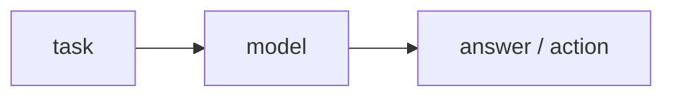
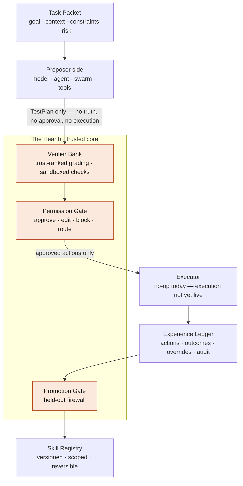
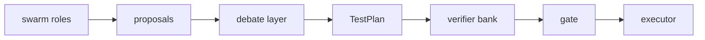

  <picture>
    <source media="(prefers-color-scheme: dark)" srcset="docs/brand/promethyn-lockup-horizontal-dark.svg">
    
  </picture>

<strong>A verifier-first runtime for reversible, self-improving AI systems.</strong>

  <a href="docs/open-core-boundary.md">Open-core boundary</a> ·
  <a href="#current-status">Status</a> ·
  <a href="#the-core-idea">Core idea</a> ·
  <a href="#the-hearth">The Hearth</a> ·
  <a href="#contributing">Contributing</a>

---

Promethyn is an open protocol and reference runtime for building AI systems that can improve over time without drifting into ungrounded certainty.

It is not a model.
It is the system around a model.

A model, agent, or swarm may propose work. Promethyn decides what can be trusted, what can be executed, what can be learned, and what must be blocked, routed, or forgotten.

> A self-improving system is only as safe as its ability to find out when it is wrong.
> Promethyn treats verification as the master key.

## Current status

Promethyn is pre-1.0 and under active development. Most of the open core is already built and on `main`. The project is a public, inspectable blueprint for a verifiable learning runtime — the goal is to make the safety boundary explicit, testable, and hard to bypass, not to hide it behind magic.

**One thing to know up front:** execution is deliberately **not yet live**. The executor is a no-op today. The system reasons about and grades proposed actions for real, but it does not act on the world yet. That ordering is intentional — Promethyn learns to judge before it is allowed to act, and live execution only turns on once it runs inside the sandbox with the gate routing low-confidence actions to a human.

**Built and on `main`:**

- Core type system and the typed proposer/judge wall
- Verifier bank with calibrated trust ranking, wired into the runtime
- A calibrated soft model-judge alongside the authoritative hard verifier
- Permission gate and held-out firewall
- Experience ledger and scoped memory
- Skill registry (versioned, reversible)
- Local runtime and CLI
- Swarm proposer with provider-backed roles and a mandatory, non-removable skeptic
- Sandbox isolation for untrusted candidate code — network-denied, filesystem-constrained, resource-bounded, and adversarially tested
- A conformance suite for the safety invariants

**Deliberately not yet live:**

- **Tool execution.** The executor is a no-op. Nothing reaches the world until execution runs inside the sandbox under gate approval, with low-confidence actions routed to a human.

**Next:**

- Live, sandboxed tool execution
- Verifiers for domains beyond code
- A hosted control plane (commercial)

This repository answers one question: **how can an AI system earn competence over time without corrupting itself?**

## The core idea

Most agent systems follow a simple loop:

Promethyn uses a stricter one:

The model does not get to decide what is true. The swarm does not get to decide what is true. Memory does not get to decide what is true.

Only the verifier bank can grade claims against evidence, and only the gate can authorize action.

## Why Promethyn exists

Modern AI systems are getting better at acting, remembering, planning, and using tools. That creates a new problem:

| Capability         | Failure mode                                     |
| ------------------ | ------------------------------------------------ |
| Memory             | Bad lessons become persistent behavior           |
| Agent autonomy     | Confident actions execute before being grounded  |
| Multi-agent debate | Consensus gets mistaken for truth                |
| Continual learning | The system improves on noise, not reality        |
| Tool use           | Unverified assumptions become real-world actions |
| Fine-tuning        | Bad updates become hard to inspect or reverse    |

Promethyn is built around the opposite principle: **improvement must be earned.** A system may propose, simulate, remember, and reason — but nothing becomes trusted skill until it survives verification, gating, outcome tracking, and promotion.

## Architecture

## The hard wall

Promethyn enforces a proposer/judge boundary, by type, not by convention.

The proposer side can produce: hypotheses, options, forecasts, critiques, proposed actions, and test plans.

The proposer side **cannot** produce: truth, approval, execution authority, promoted skills, permanent memory, verifier judgments, or gate decisions.

The first object allowed to assert grounded confidence is a verifier-bank judgment. The first object allowed to authorize execution is a gate decision.

## What makes Promethyn different

| Common pattern                        | Promethyn pattern                                       |
| ------------------------------------- | ------------------------------------------------------- |
| The model answers directly            | The model proposes; the runtime grades                  |
| Agents debate until they agree        | Consensus produces testable candidates only             |
| Memory is treated as context          | Memory is scoped, editable, and trust-ranked            |
| Skills are hidden in weights          | Skills live in an inspectable registry                  |
| Fine-tuning changes behavior opaquely | Skill promotion is versioned and reversible             |
| Guardrails sit after generation       | Verification and permission are core runtime primitives |
| Logs are for debugging                | The ledger is the audit and learning substrate          |

## Simulation swarm

Promethyn supports a reasoning swarm, but the swarm is only a proposer. A swarm may assemble task-specific roles — domain expert, user simulator, strategy planner, skeptic, policy reviewer, outcome forecaster, resource optimizer, evidence judge — to widen the proposal space and attach falsification checks. It cannot certify its own conclusions.

The skeptic and policy reviewer are mandatory roles for high-impact tasks. They cannot be voted out by the swarm, and in the code domain the skeptic's falsification checks are executed for real by the hard verifier.

## Verifiable learning

Promethyn does not assume an action worked because it sounded good. It records what was attempted, what evidence existed before execution, what the verifier judged, what the gate allowed, what actually happened, whether a human overrode it, whether the outcome supported the forecast, and whether the pattern should become reusable skill.

Only repeated, verified, scoped wins can become promoted skills. A bad lesson should be a deletable row, not permanent damage inside model weights.

## The Hearth

The trusted core of Promethyn is called the Hearth — the small, contained vessel that holds the fire safely.

The Hearth contains: the verifier bank, the permission gate, the held-out firewall, the proposer/judge wall, the execution-authorization boundary, ledger commitments, and the promotion rules.

Everything riskier sits around it, contained: models, swarms, soft verifiers, generated plans, memory candidates, and tool proposals.

The Hearth is intentionally small, typed, inspectable, and difficult to bypass. The rule for every change is one question: *does this belong in the Hearth, or is it a contained module?* Keeping the trusted core small is what keeps it verifiable.

## Open-core boundary

Promethyn is open where trust is created and commercial where trust is operated.

The open-source project owns: the protocol specification, core types, invariants, conformance tests, the local runtime, verifier interfaces, gate interfaces, the sandbox executor, scoped-memory interfaces, the skill-registry interface, the model-provider boundary, and the swarm proposer layer.

Commercial products may provide: a hosted verifier bank, a managed audit ledger, a managed skill registry, enterprise dashboards, compliance packs, production connectors, private deployments, team workspaces, advanced analytics, conformant verifier distribution, and SLA support.

The commercial product may operate and scale the protocol. It may not privately redefine it. See [`docs/open-core-boundary.md`](docs/open-core-boundary.md) for the full boundary, the conformance-mark policy, and the safety-core guarantees.

## What Promethyn is useful for

Promethyn is useful wherever work recurs and success is checkable. Today it ships a working verifier for the **software-engineering** domain — tests, builds, lint, and security checks, run inside the sandbox. The other domains below are what the protocol is **designed** to serve; each needs a domain-specific verifier that is not yet built.

| Domain                | What Promethyn can verify                                    | Status                         |
| --------------------- | ------------------------------------------------------------ | ------------------------------ |
| Software engineering  | tests, builds, lint, security scans, review outcomes         | ✅ implemented today            |
| Customer operations   | response quality, escalation decisions, task completion      | ◻ designed for — not yet built |
| Finance workflows     | policy checks, document evidence, approval outcomes          | ◻ designed for — not yet built |
| Research agents       | source quality, citation validity, prediction accuracy       | ◻ designed for — not yet built |
| Personal agents       | user corrections, completed tasks, calendar actions          | ◻ designed for — not yet built |
| Enterprise automation | tool results, human approvals, audit trails, rollback events | ◻ designed for — not yet built |

Promethyn is **less** useful where no meaningful ground truth exists. Where verification is impossible, Promethyn is built to route, ask, defer, or stay silent — rather than fake a verifier and optimize against it.

## Non-goals

Promethyn is not: a new base model, a wrapper around a single model provider, a prompt library, a chatbot UI, a replacement for human judgment in high-risk workflows, a system that treats model confidence as truth, or a system that treats swarm consensus as truth.

## License

The open-source license for the public protocol, SDKs, local runtime, conformance tests, and reference implementations is the Apache License 2.0. Commercial hosted services, enterprise deployments, dashboards, production connectors, and managed infrastructure may be proprietary. See [`docs/open-core-boundary.md`](docs/open-core-boundary.md).

The Python package installs as `prometheus_protocol`; the project and brand name is Promethyn.

## Contributing

Promethyn welcomes contributions that strengthen the protocol, improve conformance, clarify safety boundaries, add verifiers, improve local runtime behavior, or make the system easier to inspect. Contributions go through the conformance and hygiene gates as a condition of acceptance.

Contributions must preserve the central invariant:

> The proposer may suggest. The verifier judges. The gate authorizes. The ledger remembers. The registry promotes only what was earned.

See [`CONTRIBUTING.md`](CONTRIBUTING.md) and [`docs/open-core-boundary.md`](docs/open-core-boundary.md).

## The principle

Promethyn exists to make AI improvement earned, reversible, and inspectable.
